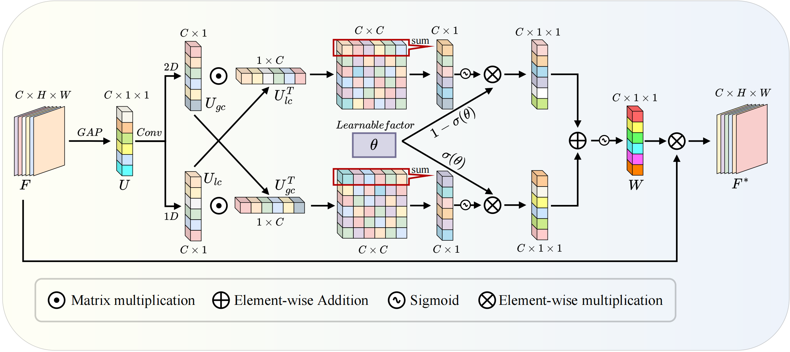

# UBRFC
Recently, the CycleGAN framework have been widely explored in image dehazing and obtained remarkable performance. However, during the training process of the dehazing method designed by CycleGAN, the input to the generator encompasses two distinct data distributions: the data in the dataset and the generated data, which can cause confusion in the learning of generator. Moreover, Squeeze and Excitation (SE) channel attention employs fully connected layers to capture global information but lacks interaction with distant local information, resulting in information loss and dilution. To solve the above problems, in this paper, we propose an Unsupervised Contrastive Bidirectional Reconstruction and Adaptive Fine-Grained Channel Attention Networks for Image Dehazing (UBRFC-Net). Specifically, a Unsupervised Contrastive Bidirectional Reconstruction Model (CBRM) is proposed to establish bidirectional reconstruction and bidirectional contrast constraints for implementing an unsupervised framework that avoids the generator in CycleGAN learning different distributions and improves the reconstruction capability. Furthermore, an Adaptive Fine-Grained Channel Attention (FCA) is developed to achieve fine-grained feature interaction between local and global channel information , enabling adaptive allocation of channel weights. Experimental results on challenging benchmark datasets demonstrate the superiority of our UBRFC-Net over state-of-the-art unsupervised image dehazing methods.
<!-- PROJECT SHIELDS -->

[![Contributors][contributors-shield]][contributors-url]
[![Forks][forks-shield]][forks-url]
[![Stargazers][stars-shield]][stars-url]
[![Issues][issues-shield]][issues-url]
[![MIT License][license-shield]][license-url]

<!-- PROJECT LOGO -->
<br />

<p align="center">
  <a href="https://gitee.com/lose_recall/ubrfc-net">
    
  </a>
  <h3 align="center">Contrastive Bidirectional Reconstruction Framework</h3>
  <p align="center">
  <a href="https://gitee.com/lose_recall/ubrfc-net">
    
  </a>
  </p>
  <h3 align="center">Adaptive Fine-Grained Channel Attention</h3>

  <p align="center">
    Partial Siamese Networks with Multiscale Bi-codec Information Fusion Module for Remote Sensing Single Image Dehazing
    <br />
    <a href="https://gitee.com/lose_recall/ubrfc-net"><strong>Exploring the documentation for UBRFC-Net »</strong></a>
    <br />
    <br />
    <a href="https://gitee.com/lose_recall/ubrfc-net">Check Demo</a>
    ·
    <a href="https://gitee.com/lose_recall/ubrfc-net/issues">Report Bug</a>
    ·
    <a href="https://gitee.com/lose_recall/ubrfc-net/issues">Pull Request</a>
  </p>

</p>

## Contents

- [Dependencies](#dependences)
- [Filetree](#filetree)
- [Pretrained Model](#pretrained-weights-and-dataset)
- [Train](#train)
- [Test](#test)
- [Clone the repo](#clone-the-repo)
- [Qualitative Results](#qualitative-results)
  - [Results on HRSD-DHID remote sensing Dehazing Challenge testing images:](#results-on-hrsd-dhid-remote-sensing-dehazing-challenge-testing-images)
  - [Results on HRSD-LHID remote sensing Dehazing Challenge testing images:](#results-on-hrsd-lhid-remote-sensing-dehazing-challenge-testing-images)
  - [Results on Statehaze1k-Thin remote sensing Dehazing Challenge testing images:](#results-on-statehaze1k-thin-remote-sensing-dehazing-challenge-testing-images)
  - [Results on Statehaze1k-Moderate remote sensing Dehazing Challenge testing images:](#results-on-statehaze1k-moderate-remote-sensing-dehazing-challenge-testing-images)
  - [Results on Statehaze1k-Thick remote sensing Dehazing Challenge testing images:](#results-on-statehaze1k-thick-remote-sensing-dehazing-challenge-testing-images)
  - [Results on NTIRE 2021 NonHomogeneous Dehazing Challenge testing images:](#results-on-ntire-2021-nonhomogeneous-dehazing-challenge-testing-images)
  - [Results on RESIDE-Outdoor Dehazing Challenge testing images:](#results-on-reside-outdoor-dehazing-challenge-testing-images)
- [Copyright](#copyright)
- [Thanks](#thanks)

### Dependences

1. Pytorch 1.8.0
2. Python 3.7.1
3. CUDA 11.7
4. Ubuntu 18.04

### Filetree

```
├── README.md
├── /PSMB-Net/
|  ├── train.py
|  ├── test.py
|  ├── Model.py
|  ├── Model_util.py
|  ├── perceptual.py
|  ├── train_dataset.py
|  ├── test_dataset.py
|  ├── utils_test.py
|  ├── make.py
│  ├── /pytorch_msssim/
│  │  ├── __init__.py
│  ├── /datasets_train/
│  │  ├── /hazy/
│  │  ├── /clean/
│  ├── /datasets_test/
│  │  ├── /hazy/
│  │  ├── /clean/
│  ├── /output_result/
├── LICENSE.txt
└── /images/
```

### Pretrained Weights and Dataset

Download our model weights on Baidu cloud disk: https://pan.baidu.com/s/1dePHGG4MYvyuLW5rZ0D8VA?pwd=lzms

Download our test datasets on Baidu cloud disk: https://pan.baidu.com/s/1HK1oy4SjZ99N-Dh-8_s0hA?pwd=lzms


### Train

```shell
python train.py -train_batch_size 4 --gpus 0 --type 5
```

### Test

 ```shell
python test.py --gpus 0 --type 5
 ```

### Clone the repo

```sh
git clone https://github.com/thislzm/PSMB-Net.git
```

### Qualitative Results

#### Results on HRSD-DHID remote sensing Dehazing Challenge testing images
<div style="text-align: center">

</div>

#### Results on HRSD-LHID remote sensing Dehazing Challenge testing images
<div style="text-align: center">

</div>

#### Results on Statehaze1k-Thin remote sensing Dehazing Challenge testing images
<div style="text-align: center">

</div>

#### Results on Statehaze1k-Moderate remote sensing Dehazing Challenge testing images
<div style="text-align: center">

</div>

#### Results on Statehaze1k-Thick remote sensing Dehazing Challenge testing images
<div style="text-align: center">

</div>

#### Results on NTIRE 2021 NonHomogeneous Dehazing Challenge testing images
<div style="text-align: center">

</div>

#### Results on RESIDE-Outdoor Dehazing Challenge testing images
<div style="text-align: center">

</div>


### Copyright

The project has been licensed by MIT. Please refer to for details. [LICENSE.txt](https://github.com/thislzm/PSMB-Net/LICENSE.txt)

### Thanks


- [GitHub Emoji Cheat Sheet](https://www.webpagefx.com/tools/emoji-cheat-sheet)
- [Img Shields](https://shields.io)
- [Choose an Open Source License](https://choosealicense.com)
- [GitHub Pages](https://pages.github.com)


<!-- links -->
[your-project-path]:Lose-Code/UBRFC-Net
[contributors-shield]: https://img.shields.io/github/contributors/Lose-Code/UBRFC-Net.svg?style=flat-square
[contributors-url]: https://github.com/Lose-Code/UBRFC-Net/graphs/contributors
[forks-shield]: https://img.shields.io/github/forks/Lose-Code/UBRFC-Net.svg?style=flat-square
[forks-url]: https://github.com/Lose-Code/UBRFC-Net/network/members
[stars-shield]: https://img.shields.io/github/stars/Lose-Code/UBRFC-Net.svg?style=flat-square
[stars-url]: https://github.com/Lose-Code/UBRFC-Net/stargazers
[issues-shield]: https://img.shields.io/github/issues/Lose-Code/UBRFC-Net.svg?style=flat-square
[issues-url]: https://img.shields.io/github/issues/Lose-Code/UBRFC-Net.svg
[license-shield]: https://img.shields.io/github/license/Lose-Code/UBRFC-Net.svg?style=flat-square
[license-url]: https://github.com/Lose-Code/UBRFC-Net/blob/master/LICENSE.txt
[linkedin-shield]: https://img.shields.io/badge/-LinkedIn-black.svg?style=flat-square&logo=linkedin&colorB=555
[linkedin-url]: https://linkedin.com/in/shaojintian